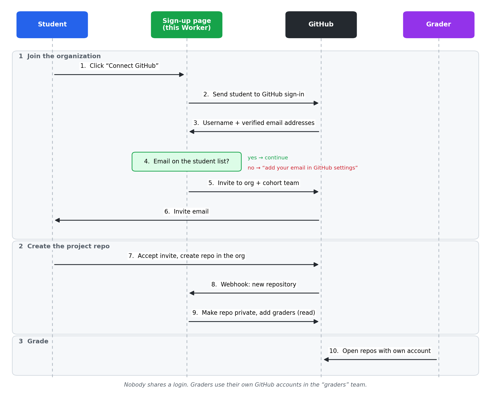

# org_invite_pattern

Let students join your GitHub organization by themselves, the way Epic Games gives
people access to the Unreal Engine repository. Every student repository ends up
private and readable by your graders, and nobody shares a GitHub login.

## How it works



1. The student opens the page and signs in with GitHub.
2. The Worker reads their **verified** email addresses from GitHub. If one is on
   the student list, it invites them to the organization and their cohort team.
3. The student accepts the invite and creates their project repository in the organization.
4. GitHub tells the Worker about the new repository. The Worker makes it private
   and gives the `graders` team read access.

Graders use their own GitHub accounts. To add a grader, add them to the `graders` team.

## What students are told

> Go to `<your Worker URL>` and click **Connect GitHub**. Accept the invite, then
> create your project repository in the `<org>` organization.

If their program email is not on their GitHub account yet, the page tells them to add
and verify it under GitHub **Settings → Emails**, then try again.

## Setup

You need: a GitHub organization (owner access), a Cloudflare account (free plan is enough), and Node.js 20+.

### 1. Organization settings

In **Organization settings**:

| Setting | Value | Why |
|---|---|---|
| Member privileges → Base permissions | **No permission** | Students cannot see each other's repos |
| Member privileges → Repository creation | **Public** and **Private** allowed | Students create their own repos. The free plan cannot allow only private; the Worker makes public repos private right away |
| Member privileges → Allow members to delete or transfer repositories | **Off** | Submissions stay in the org |
| Teams | Create `graders`, and one team per cohort (e.g. `cohort-2026-10`) | Graders read everything; cohorts make clean-up easy |

Do **not** make graders organization owners. Owners can delete repositories and change billing.

### 2. Create the GitHub App

**Organization settings → Developer settings → GitHub Apps → New GitHub App**

| Field | Value |
|---|---|
| Homepage URL | your Worker URL |
| Callback URL | `<Worker URL>/callback` |
| Webhook URL | `<Worker URL>/webhook` |
| Webhook secret | a long random string (`openssl rand -hex 32`) |
| Repository permissions | **Administration: Read and write**, Metadata: Read |
| Organization permissions | **Members: Read and write** |
| Account permissions | **Email addresses: Read** |
| Subscribe to events | **Repository** |
| Where can this app be installed? | Only on this account |

Then on the App page:

1. Note the **App ID** and **Client ID**.
2. **Generate a client secret.**
3. **Generate a private key** and convert it to PKCS#8:
   `openssl pkcs8 -topk8 -nocrypt -in app.private-key.pem -out app.pkcs8.pem`
4. **Install App** on your organization, for **all repositories**.

### 3. Deploy the Worker

```sh
npm install
npx wrangler login
npx wrangler kv namespace create ROSTER       # copy the id into wrangler.toml
```

Fill in `[vars]` and the KV `id` in `wrangler.toml`, then:

```sh
npx wrangler secret put APP_PRIVATE_KEY < app.pkcs8.pem
npx wrangler secret put CLIENT_SECRET
npx wrangler secret put WEBHOOK_SECRET
npm run deploy
```

Make sure `BASE_URL` in `wrangler.toml` and the URLs in the GitHub App match the deployed URL.

### 4. Load the student list

Make a CSV with one student per line, `email,team`:

```csv
email,team
alice@example.com,cohort-2026-10
bob@example.com,cohort-2026-10
```

```sh
npm run roster students.csv > roster.json
npx wrangler kv bulk put roster.json --binding ROSTER --remote
```

Run this again whenever the list changes. Keep the CSV and `roster.json` out of git; they contain personal data.

### 5. Test it

Add your own email to the list, open the Worker URL, and click **Connect GitHub**.
Accept the invite, create a public repository in the organization, and check that it
turns private and that `graders` has read access.

## Good to know

- **Invites expire after 7 days.** The student just connects again.
- **GitHub limits invites per day**, and new or free organizations get a lower limit. Spread out large cohorts.
- **The Worker never stores tokens.** The student's GitHub token is used once and revoked.
- **Leaving the program:** remove the cohort team's members from the organization. Their repositories stay in the organization.
- **Tests:** `npm test` runs the Worker against a fake GitHub API.

## Files

| File | What it does |
|---|---|
| `src/index.js` | The pages, the invite flow and the webhook |
| `src/github.js` | GitHub API helpers: App JWT, tokens, webhook signature check |
| `scripts/roster.mjs` | Turns the student CSV into a file for Workers KV |
| `test/worker.test.mjs` | Tests against a fake GitHub API |
| `wrangler.toml` | Cloudflare Worker settings |
| `docs/diagram.py` | Draws `docs/flow.png` and `docs/flow.svg` (`python docs/diagram.py`, needs matplotlib) |
